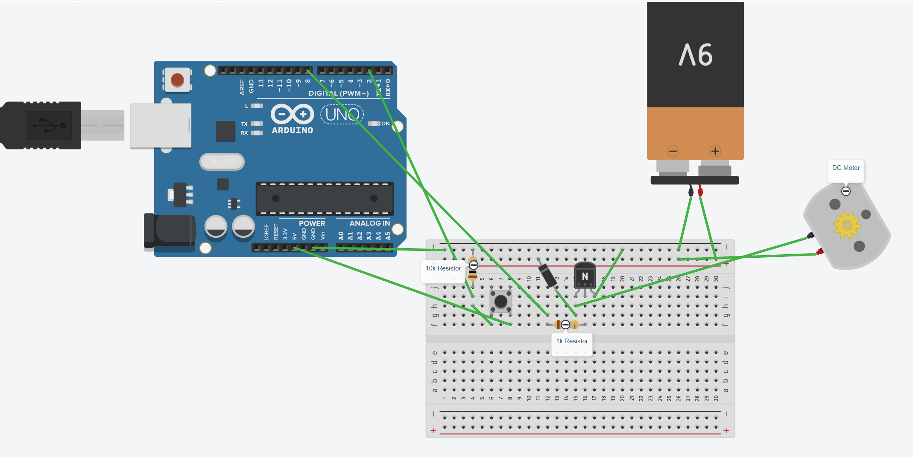

# Arduino Fan Toggle Project

This project uses an Arduino Uno, a pushbutton, and an NPN transistor to toggle a 9V-powered DC fan on and off. It demonstrates basic digital input handling, transistor switching, and circuit protection with a flyback diode.

## Features

- Toggle fan ON/OFF with a single button press
- Fan powered by external 9V battery
- Uses an NPN transistor (e.g., 2N2222) as a switch
- Includes a flyback diode to suppress back-EMF from the fan
- Debouncing logic for stable button presses

## Components Used

- Arduino Uno
- DC fan (5V–9V range)
- NPN transistor (2N2222 or similar)
- Pushbutton
- 10kΩ resistor (button pull-down)
- 1kΩ resistor (base of transistor)
- 1N4007 diode (flyback protection)
- 9V battery and battery clip
- Breadboard + jumper wires

## Circuit Diagram

  
*Flyback diode stripe faces the 9V positive rail*

## Code Summary

- Reads a digital input from the button (pin 2)
- Toggles the fan state on each button press
- Controls the fan using digital output (pin 8)
- Uses simple software debouncing

## Demo

📹 [Link to demo video here](https://yourlink.com) *(Replace this with your actual video link)*

## How It Works

1. When the button is pressed, the code detects a rising edge (`LOW` → `HIGH`).
2. A boolean variable `fanOn` is toggled.
3. The fan is switched ON/OFF using a transistor connected to pin 8.
4. A 1N4007 diode across the fan prevents voltage spikes when the fan turns off.

---

Feel free to fork or improve this project — it's a great base for remote control, PWM speed control, or sensor-triggered systems.
